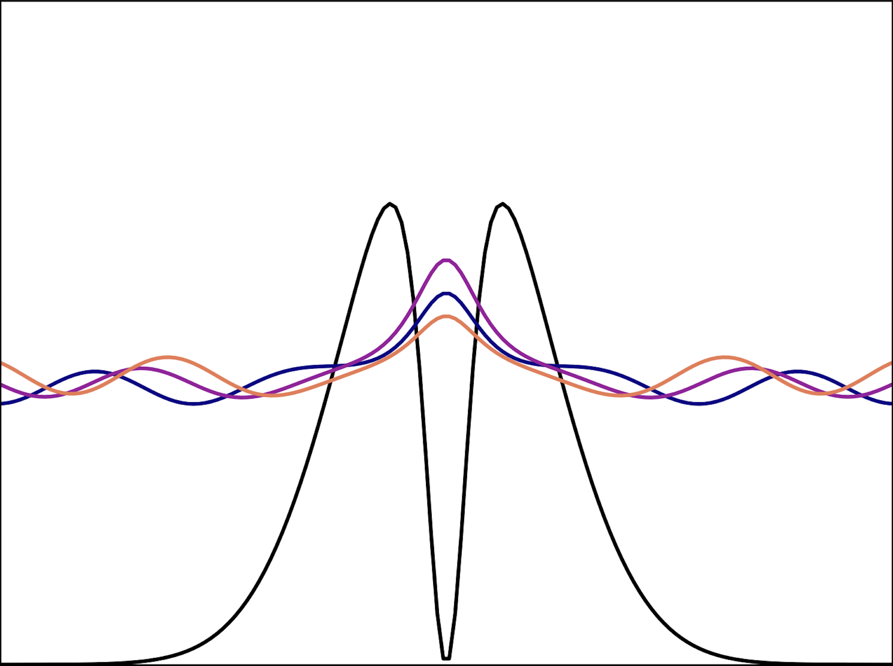

# 1DResonance

A collection of Jupyter notebook files that demonstrate how the energy and width of a resonance can be extracted using the time-dependent schrodinger equation or non-Hermitian quantum mechanical approaches in a model one-dimensional system. 

Each notebook file features a series of numerical quantum mechanical calculations with surface-level descriptions that walk through a specific approach:

## Time-dependent Schrodinger equation in discrete variable representation (TDSE/DVR)
```
1DResonance_dynamics.ipynb
```
A dynamical approach in a discrete variable representation in which a wavepacket is prepared and then evolved using the time-dependent Schrodinger equation (TDSE).

## Projected complex absorbing potential in discrete variable representation (pCAP/DVR)
```
1DResonance_pCAP.ipynb
```
A simple, high-accuracy projected complex absorbing potential (pCAP) approach in a discrete variable representation that is parameterized similarly to the dynamics calculation.

## Projected complex absorbing potential in Gaussian basis (pCAP/Gaussian)
```
1DResonance_pCAP_Gaussian.ipynb
```
A more traditional projected complex absorbing potential (pCAP) approach that utilizes a Gaussian basis and a resonance energy trajectory (eta-trajectory) analysis to determine an optimal CAP strength.

## Acknowledgments
These exercises were inspired by the work of Shachar Klaiman and Ido Gilary:

Klaiman, S.; Gilary, I. On Resonance: A First Glance into the Behavior of Unstable States. Advances in Quantum Chemistry, 2012, 6, 1-31, DOI: 10.1016/B978-0-12-397009-1.00001-1.
